# HOYDIA  - 감성 페어와 공유하는 당신의 “요즈음”

## 

## TEAM MEMBER

|  김현열  |  채민진  | 엄지용  | 신용하  |  김태경  |
| :------: | :------: | :-----: | :-----: | :------: |
|   INFJ   |   INFJ   |  INFP   |  INFP   |   ISTJ   |
| Frontend | Frontend | Backend | Backend | Frontend |


## HOYDIA 링크 [HOYDIA](http://i7a103.p.ssafy.io:3000/)


## 프로젝트 진행 기간

2022.07.05(월) ~ 2022.08.19(금)

SSAFY 7기 2 학기 공통 프로젝트 - HOYDIA


## 배경

어린 시절 쓰던 교환 일기로부터 시작한 아이디어로 그때의 감성과 기억을 다시 살려보자는 의미에서 시작되었습니다.

hoydia는 이러한 추억과 감성을 충족시켜주기 위해 탄생한 블로그 콘텐츠 기반 SNS입니다. 

hoydia와 함께 라면, 관심사가 비슷한 상대와 일기를 교환하면서 나와 맞는 감성 친구를 찾을 수 있습니다.


## 개요

감성 페어와 공유하는 당신의 “요즈음”

hoydia는 스페인어로 요즘이라는 뜻입니다.

hoydia는 친구 or 감성 페어와 사진, 음악, 내용을 일기에 작성하고 일기장 표지를 꾸미며 감성을 공유할 수 있는 웹 서비스입니다. 


## 주요 기능

- 매칭
  - 친구의 코드를 기입하면 일기장 생성
  - 오늘의 질문에 대한 답을 하고 매칭이 이뤄지며 상대방의 질문과 대답을 보고 서로 승인하면 매칭이 이뤄집니다.

- 일기
  - 제목, 내용을 자유롭게 작성해요.
  - 일기에 어울리는 사진을 넣어보세요.
  - 원하는 폰트를 골라서 작성해보세요.
  - 일기 내용에 맞는 장소를 골라보세요.
  - 일기에 어울리는 음악이 있다면 골라보세요.
  - 혹시 전송하기 전 수정하고 싶다면 지우개를 눌러 수정해보세요.
  - 표지를 꾸미고 싶다면 edit버튼을 눌러 꾸며보세요.

- 알림함
  - 친구와 교환 일기가 만들어 졌다면 ''친구와 교환 일기 생성 완료''
  - 상대방이 작성하고 일기를 전송했다면 "일기 교환 완료"
  - 매칭이 성공했다면 "교환 일기 만들기 성공!"

- 부가 기능
  - 메인 페이지와 서랍장을 드래그 앤 드롭으로 자유롭게 이동이 가능합니다.
  - 마이페이지를 통해 유저코드를 알 수 있고 닉네임이 수정 가능합니다.


## 주요 기술

**Backend**

- IntelliJ IDE
- Springboot 2.6.3
- Spring Data JPA
- Spring Security
- Spring Validation
- Spring Web
- QueryDSL
- WebSocket
- GCP 3.0.0
- Swagger 3.0.0
- MySQL

**Frontend**

- Visual Studio Code IDE
- React 18

**CI/CD**

- AWS EC2
- NGINX
- docker


## 프로젝트 파일 구조

### Back

```
hoydia
  ├── gradle
  │   └── wrapper
  ├── src
  │   ├── main
  │   │   └── java
  │   │   │   └── com.ssafy.hoydia
  │   │   │   │   ├── client
  │   │   │   │   ├── config  
  │   │   │   │   ├── controller
  │   │   │   │   ├── domain
  │   │   │   │   ├── dto
  │   │   │   │   ├── exception
  │   │   │   │   ├── repository
  │   │   │   │   ├── service
  │   │   │   │   ├── util
  │   │   │   │   └── client
  │   │   └── resources
  │   └── test
  ├── gitignore
  ├── build.gradle
  ├── gradlew.bat
  └── settings.gradle

```

### Front

```
FRONTEND
  ├── node_modules
  ├── public
  └── src
  │   ├── assets
  │   ├── components
  │   ├── images
  │   ├── pages
  │   ├── App
  │   └── index
  ├── env
  ├── gitignore
  ├── .prettierrc
  ├── jsconfig
  ├── package-lock
  ├── package
  └── README
```


## 협업 툴

- GIt
- Notion
- JIRA
- MatterMost
- Webex


## 협업 환경

- Gitlab
  - 버전 관리
  - 이슈 발행 해결
  - MR시, 코드 리뷰를 진행
- JIRA
  - 매주 목표 량을 설정하여 Sprint 진행
  - 업무 할당량을 Story point로 설정하고, In-progress => Done 순으로 작업
- Notion
  - 아침마다 scrum을 진행하고 회의가 있을 때마다 회의록에 기록
  - 컨벤션 정리
  - 문서 관리


## 프로젝트 산출물

- API
- ERD
- 프로토타입
- 아키텍처
- 컨벤션
- 스토리보드


## 시연 GIF 및 사진

- 로그인

  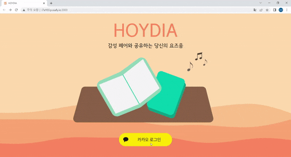

  

  

- 감성 페어 찾기

  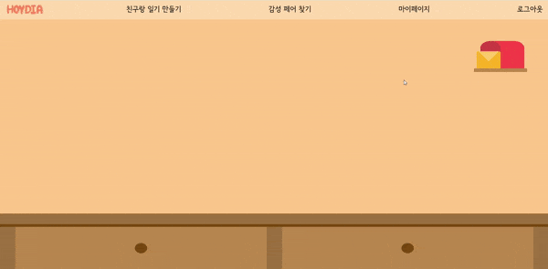


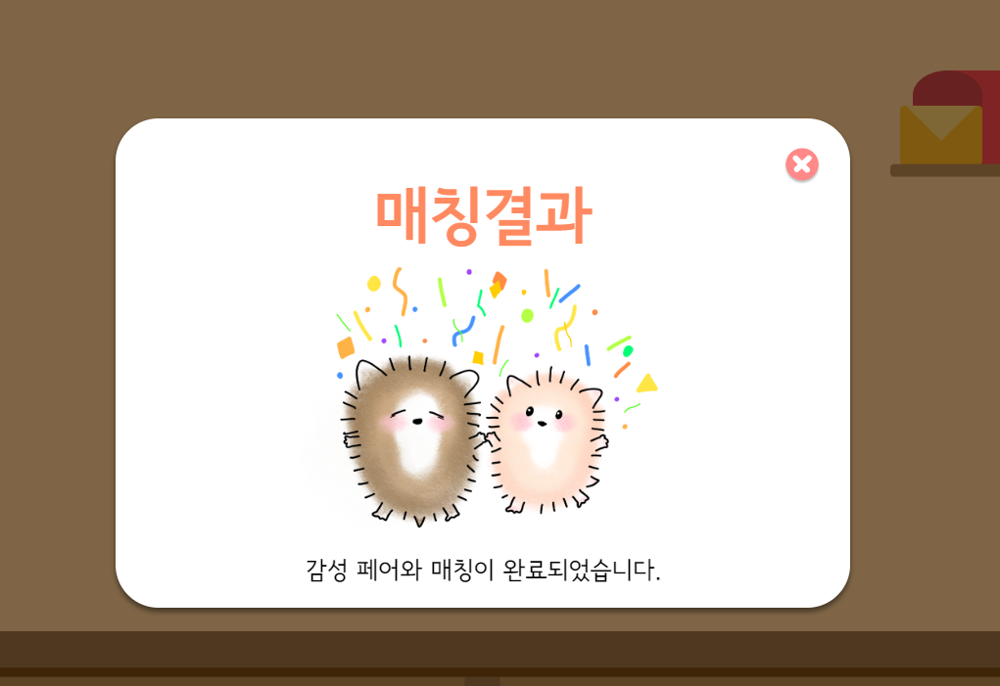


- 친구와 일기 만들기

  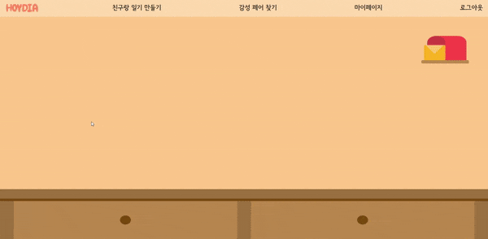

  


- 다이어리 작성

  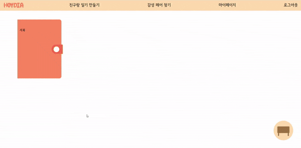

  


- 다이어리 꾸미기

  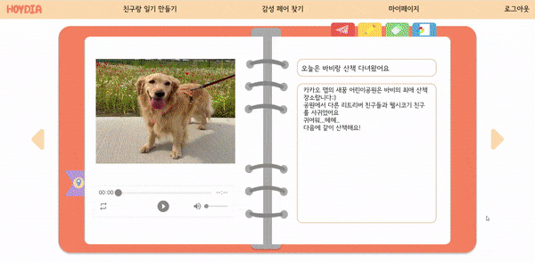

  


- 다이어리 전송

  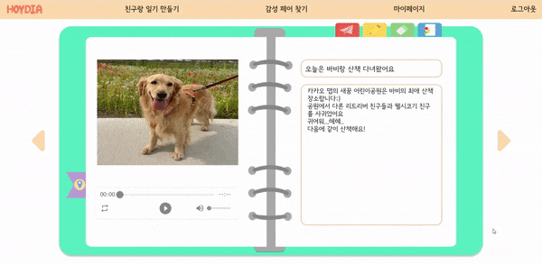


- 일기장 도착 알람

  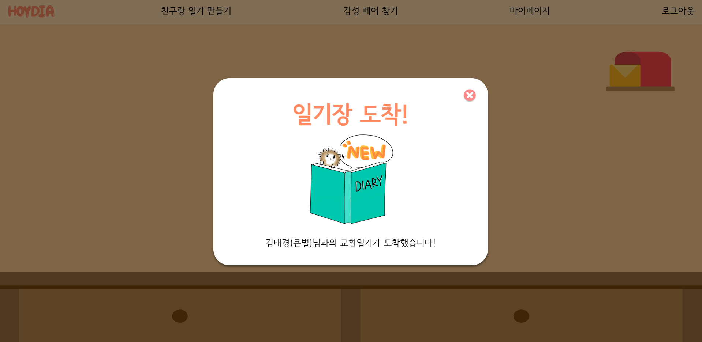


- 다이어리 드레그 앤 드롭

  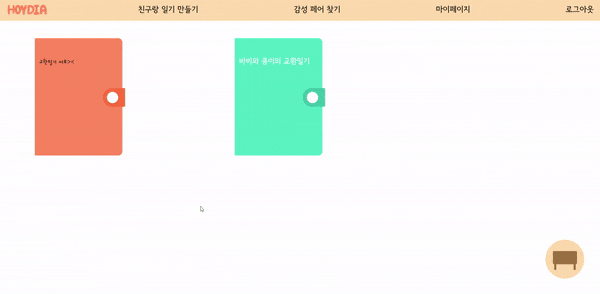


- 마이페이지 닉네임 변경

  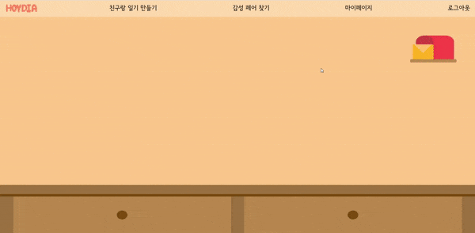


- 로그아웃

  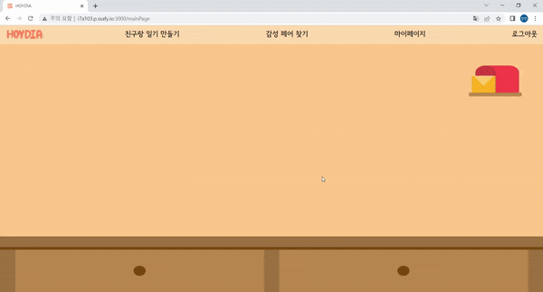
